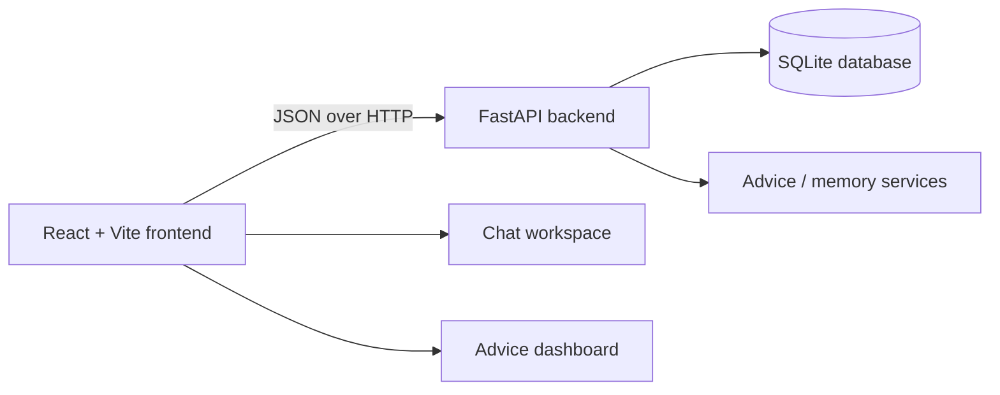

# FinPilot AI

> A production-minded conversational financial guidance system with structured advice, persistent conversations, and a focused React workspace.

[](./backend)
[](./frontend)
[](./tests)
[](#license)

FinPilot AI is a full-stack financial advice chatbot designed to make educational financial guidance easier to explore, revisit, and organize. It combines a FastAPI service, a React/Vite frontend, SQLite persistence, structured advice records, conversation management, and a brand-led interface built around cream, parchment, charcoal, and muted soft red.

The project is presented as an engineering product rather than a generic AI template. The frontend identity is associated with **Mohamed Salem — AI Engineer, Machine Learning Engineer, MLOps, and LLM Engineering**.

> **Important:** FinPilot AI provides educational information and is not a substitute for personalized financial, tax, legal, or investment advice from a qualified professional.

## Product capabilities

| Area | Capability |
| --- | --- |
| Conversational guidance | Ask questions about saving, budgeting, investing, debt, retirement, and financial concepts. |
| Persistent conversations | Create, open, search, rename, and delete conversations. The active conversation is retained in the URL. |
| Structured advice | Assistant responses can include categories, short titles, full explanations, key recommendations, and supporting data when available. |
| Advice workspace | Review recent advice, categories, topics, saved items, recommendation highlights, and paginated history. |
| API service | FastAPI endpoints for chat, conversation management, advice records, memory, and health checks. |
| Data persistence | SQLite-backed storage for conversations, advice, and memory records. |
| Quality checks | Backend pytest coverage and frontend Vitest coverage for API, state, components, and page behavior. |

## Architecture



The frontend is organized around a shared application shell, a chat state provider, an API status provider, reusable chat components, and dashboard data views. The backend exposes a small JSON API and stores local runtime data in `data/chatbot.db` by default.

## Repository structure

```text
Financial Advice Chatbot/
├── backend/               # FastAPI application and API routes
├── configs/               # Model and runtime configuration
├── docs/                  # Project documentation
├── frontend/              # React + Vite client
│   ├── src/api/           # HTTP client functions
│   ├── src/components/    # Chat, dashboard, layout, and reusable UI
│   ├── src/pages/         # Application pages
│   └── src/styles/        # Brand tokens and global styling
├── models/                # Local model artifacts; ignored by Git
├── notebooks/             # Exploration and experimentation
├── outputs/               # Generated runtime outputs; ignored by Git
├── scripts/               # Utility scripts
├── src/                   # Core Python source modules
├── tests/                 # Backend test suite
├── RUNBOOK.md             # Detailed Windows setup and operations guide
├── start.ps1              # One-command Windows launcher
├── requirements.txt       # Python dependencies
└── README.md              # Project overview and onboarding guide
```

## Quick start on Windows

The supported development workflow uses Windows PowerShell.

### Prerequisites

| Requirement | Version |
| --- | --- |
| Python | 3.10 or newer |
| Node.js | 18 or newer |
| npm | Installed with Node.js |
|

### Install dependencies

From the repository root:

```powershell
python -m pip install -r requirements.txt
cd frontend
npm install
cd ..
```

### Start the full application

```powershell
.\start.ps1
```

The launcher starts the backend and frontend in separate windows and opens the browser.

| Service | URL |
| --- | --- |
| Frontend | http://localhost:5173 |
| Backend health | http://127.0.0.1:8000/health |
| Interactive API docs | http://127.0.0.1:8000/docs |

For a path-safe manual startup when the project directory contains special characters:

```powershell
$root = (Get-Location).Path
$env:CHATBOT_DB_PATH = Join-Path $root 'data\chatbot.db'
Start-Process python -ArgumentList '-m','uvicorn','backend.main:app','--host','127.0.0.1','--port','8000','--reload' -WorkingDirectory $root
cd frontend
npm run dev
```

See [`RUNBOOK.md`](./RUNBOOK.md) for environment variables, health checks, reset instructions, ports, and troubleshooting.

## API reference

The backend uses JSON for all application endpoints.

| Method | Endpoint | Description |
| --- | --- | --- |
| `GET` | `/health` | Liveness check. |
| `POST` | `/chat` | Send a message with an optional conversation ID. |
| `GET` | `/conversations` | List conversation summaries. |
| `GET` | `/conversations/{id}` | Retrieve a complete conversation. |
| `PATCH` | `/conversations/{id}` | Rename a conversation. |
| `DELETE` | `/conversations/{id}` | Delete a conversation and related advice. |
| `GET` | `/advice` | List structured advice. |
| `GET` | `/advice/{id}` | Retrieve one advice record. |
| `POST` | `/advice/{id}/save` | Mark advice as saved. |
| `GET` | `/memory` | List stored memory records. |

Interactive Swagger documentation is available at [http://127.0.0.1:8000/docs](http://127.0.0.1:8000/docs) while the backend is running.

## Testing

Run the backend suite:

```powershell
python -m pytest tests -q
```

Run the frontend suite:

```powershell
cd frontend
npm test -- --run
cd ..
```

Run the frontend production build:

```powershell
cd frontend
npm run build
cd ..
```

Or run the documented full regression workflow:

```powershell
.\start.ps1 -Test
```

## Configuration and data

The default SQLite database is stored at `data/chatbot.db`. Set a custom location before starting the backend when needed:

```powershell
$env:CHATBOT_DB_PATH = 'C:\path\to\chatbot.db'
```

CORS origins can be restricted with:

```powershell
$env:CHATBOT_CORS_ORIGINS = 'http://localhost:5173,http://127.0.0.1:5173'
```

Runtime databases, local model artifacts, logs, generated outputs, environment files, dependency directories, and build output are intentionally excluded from version control.

## Design direction

The frontend follows a deliberate visual system:

| Token family | Direction |
| --- | --- |
| Foundation | Warm cream and ivory rather than cool grey or dark generic SaaS surfaces. |
| Accent | Muted soft red for actions, active states, recommendation emphasis, and important highlights. |
| Text | Warm charcoal and cocoa tones for readable technical content. |
| Surfaces | Parchment and ivory layers with subtle borders and restrained shadows. |
| Typography | Modern sans-serif hierarchy with editorial spacing and engineering-oriented metadata. |
| Interaction | Explicit loading, empty, error, retry, save, rename, delete, and active states. |

## Security and responsible use

Do not commit API keys, credentials, user databases, model weights, private conversations, or production secrets. Use environment variables for deployment-specific configuration. Financial guidance shown by the application is educational and should be reviewed critically before any real-world financial decision.

## License

This repository is maintained as a private project. Licensing and redistribution terms should be confirmed by the project owner before public release.

## Author

**Mohamed Salem**  
AI Engineer · Machine Learning Engineer · MLOps · LLM Engineering
