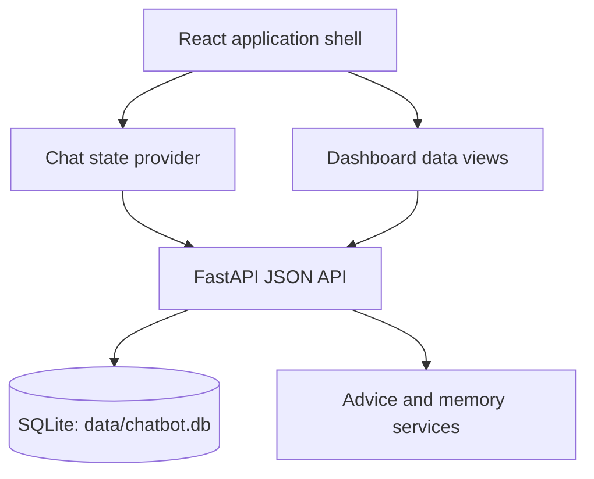

# FinPilot AI Architecture

## System boundary

FinPilot AI is a local full-stack application composed of a React/Vite client and a FastAPI service. The browser communicates with the backend over JSON HTTP requests. The backend owns persistence and domain orchestration; the frontend owns presentation, local interaction state, and navigation between the chat and dashboard views.

## Frontend boundaries

The frontend uses a shared shell with two primary views: the chat workspace and the advice dashboard. `ChatContext` owns active conversation state, message state, conversation loading, optimistic sending, URL persistence, rename, delete, and refresh flows. The dashboard requests advice records and derives recent items, saved items, category groups, topic counts, and history views without changing the backend contract.

Visual components are intentionally separated from functional orchestration. This allows the interface to be rebuilt without replacing the API client or state transitions.

## Backend boundaries

The FastAPI application exposes health, chat, conversation, advice, and memory endpoints. SQLite is used for local persistence. The database path is controlled by `CHATBOT_DB_PATH`, which allows development and test environments to use isolated files.

## State contract

The following user-visible states are considered part of the application contract and must remain available during frontend redesigns:

| State | Expected behavior |
| --- | --- |
| Empty chat | Explain the product and provide suggested prompts. |
| Loading history | Show that the selected conversation is being restored. |
| Sending | Show an assistant typing/loading state and prevent duplicate sends. |
| Assistant reply | Render text and structured advice when supplied by the backend. |
| Error | Explain the failure and offer retry where recovery is possible. |
| Conversation management | Support search, open, rename, delete confirmation, and new conversation. |
| Dashboard loading | Show an explicit loading state while advice is fetched. |
| Dashboard empty | Explain what will appear after the first conversation. |
| Saving | Show saving and saved states without inventing data. |

## Deployment note

The repository currently targets local Windows development. Production deployment should add a secret-management strategy, locked-down CORS origins, database backup policy, authentication requirements, and an explicit model-serving plan before exposing the service publicly.
